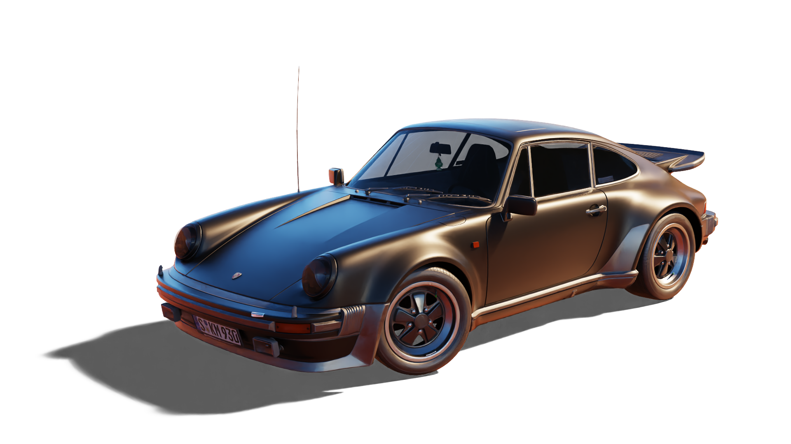

# Path Tracer

🌇 Path tracing software that can generate life-like images from GLTF scenes.

## Features

- Full support for basic PBR metallic-roughness materials via the GLTF ecosystem.
- HDRI maps support.
- Ability to import multiple cameras and sunlights.
- Full transparency support.
- Easy to use Python script that denoises your renders using Open Image Denoise.
- Fully optimized multithreading.

## Gallery

<div style="display: flex; flex-direction: row; flex-wrap: wrap; justify-content: center;">
	<div style="display: flex; flex-direction: column;">
		
		
		
		
	</div>
	<div style="display: flex; flex-direction: column;">
		
		
		
		
	</div>
</div>

## Getting Started

### Prerequisites

- **[Conan](https://conan.io/downloads.html)** Package Manager
- **[CMake](https://cmake.org/download/#latest)**
- **[LLVM](https://releases.llvm.org/download.html)** + Clang
- Intel **[Open Image Denoise](https://www.openimagedenoise.org/downloads.html)**

### Example

```cpp
int main() {
	core::renderer renderer;
	renderer.sample_count = 10000;
	renderer.bounce_count = 4;
	renderer.resolution = math::uvec2(1920, 1080);
	renderer.thread_count = 0;
	renderer.transparent_background = true;

	auto hdri = image::image::load("assets/dirt-road.hdr", false);
	renderer.environment = std::make_shared<image::image_texture>(hdri);
	renderer.environment_factor = math::fvec3(3);

	renderer.camera_index = 1;
	renderer.sun_light_index = 0;
	renderer.load_gltf("assets/porsche/porsche.gltf");

	renderer.sun_light->angular_radius = 0.05F;
	renderer.render("renders/porsche.png");

	return 0;
}
```

### Building

```
conan install -s build_type=Release -if build . --build=missing
cmake -B ./build -S . -DCMAKE_BUILD_TYPE=Release
cmake --build ./build --target PathTracer --config Release
```

### Rendering & Denoising

```
./build/bin/path-tracer
python ./denoise.py ./renders/porsche.png
```

## About

### Authors

- Ray Ferric (**[rayferric](https://github.com/rayferric)**)

### License

This project is licensed under the MIT License. See the **[LICENSE](LICENSE)** file for details.
