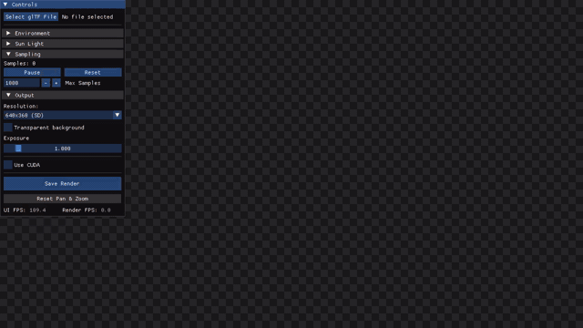
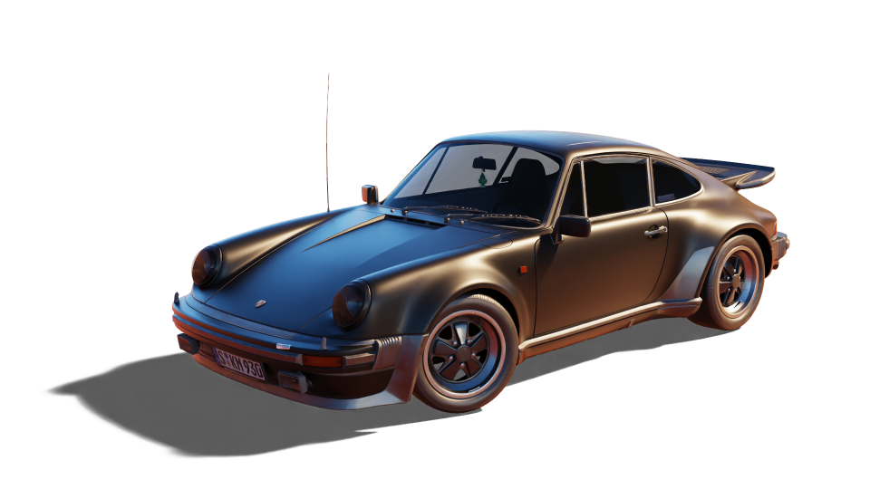
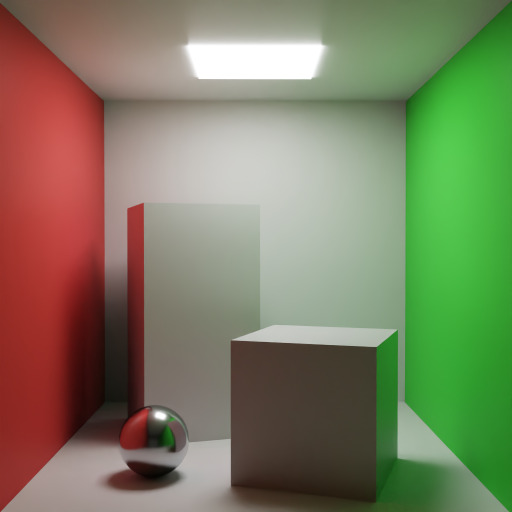
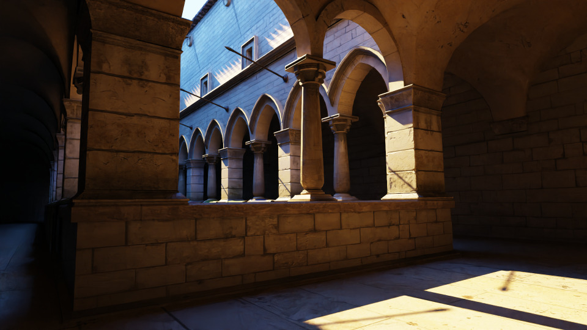
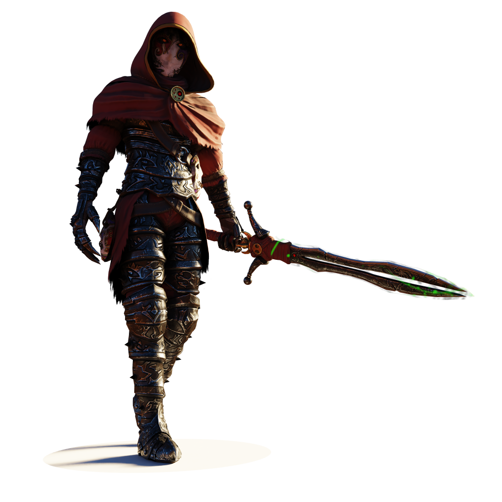
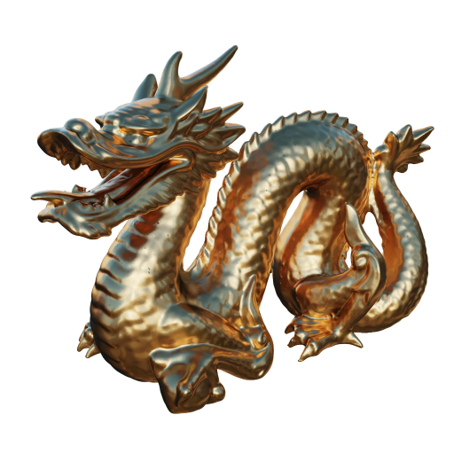
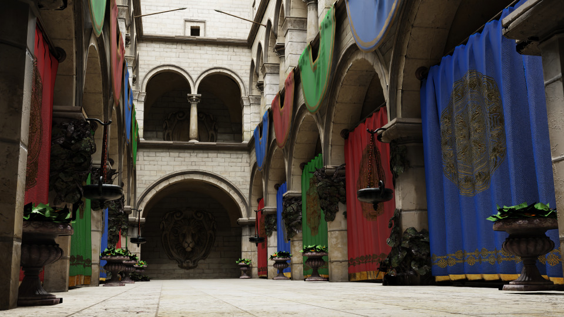
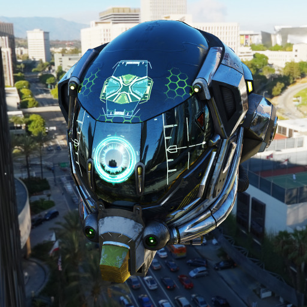
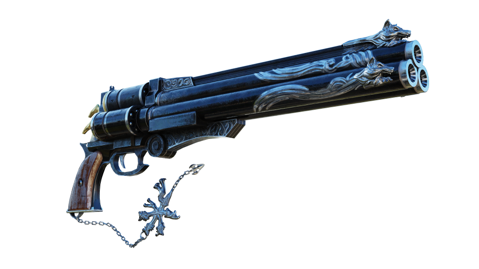

## Demo



## Gallery

<div style="display: flex; flex-direction: row; flex-wrap: wrap; justify-content: center;">
	<div style="display: flex; flex-direction: column;">
		
		
		
		
	</div>
	<div style="display: flex; flex-direction: column;">
		
		
		
		
	</div>
</div>

## Features

- Realistic path tracing with PBR metallic-roughness materials
- CUDA GPU-accelerated backend
- Alternative CPU backend with tiling scheduler
- Interactive GUI render editor
- GLTF scene import with emissive objects, sunlight and cameras
- HDRI environment maps
- Transparent rendering for compositing

## Building

### Dependencies

- **[CMake](https://cmake.org/download/#latest)**
- **[CUDA SDK](https://developer.nvidia.com/cuda-downloads)**

### Commands

```
mkdir ./build
cmake -B ./build -S . -DCMAKE_BUILD_TYPE=Release
cmake --build ./build --config Release
./build/path_tracer
```

## Architecture Overview

### Modules (high-level):

- **Scene module:** Geometry, materials, and textures packaged into a single struct compatible with the path tracing algorithm; includes functions for loading from gltf files and BVH generation, plus functions for copying the data to a CUDA device.
- **Path tracing module:** Given a struct `scene_data` and an output image buffer, the code here traces rays in the scene and produces the final color.
- **OpenGL application module:** OpenGL window app providing an interactive frontend for the path tracer; includes an ImGui menu with path tracing algorithm controls and a 2D image viewer with the ability to inspect, zoom, and pan the path tracer output image.

Files in `./src`:

- `pch.hpp`: Precompiled header including all third-party code.
- `main.cpp`: Implements the OpenGL app; many systems are abstracted away in the `gl_app` directory and called from `main`.
- `path_tracing.hpp`: Public API of the path tracing module, implemented in `path_tracing_impl`.
- `scene.hpp`: Public API of the scene module, implemented in `scene_impl`.

Dirs in `./src`:

- `cuda_commons`: Included in `pch.hpp`, includes CUDA; specifically, it only includes `cuda_runtime.h` if the compiler is NVCC. It also provides common CUDA utilities like error check macros and `cudaMalloc` wrappers; these are needed since we cannot access CUDA outside of `.cu` translation units, allowing us to allocate device memory from `.cpp` units (which is quick and dirty but handy because the path tracing module public API requires a CUDA-allocated buffer as an argument).
- `gl_app`: Subsystems of the OpenGL app.
- `path_tracing_impl`: Implementation details of the path tracer.
- `scene_impl`: Implementation details of the scene module.

### More on scene module:

Public API:

```cpp
scene my_scene("scene.gltf");
my_scene.load_hdri("envmap.hdr");
cuda_scene my_scene_on_gpu(my_scene);
scene_data *data_cpu = (scene_data *)&my_scene;
scene_data *data_gpu = (scene_data *)&my_scene_on_gpu;
```
- Both `scene` and `cuda_scene` classes inherit from the `scene_data` struct, providing RAII-style memory management (no need to manually free dynamic buffers).
- The `scene_data` struct contains:
  - Dynamic-allocated (`malloc` or `cudaMalloc` if CUDA is used) buffers with different types of data like texture image bytes, material configs, triangle vertices (positions, normals, UVs), and BVH nodes (a binary tree organizing the geometry, necessary to speed up ray tracing).
  - POD members for global parameters like camera pose, sun color, direction, intensity.

```c
struct scene_data {
	uint8_t *texture_data;
	uint32_t texture_data_sz;

	texture_info *textures;
	material *materials;
	triangle *triangles;
	bvh_node *bvh_nodes;
	uint32_t num_textures, num_materials, num_triangles, num_bvh_nodes;

	glm::mat4 camera_transform;
	// glm::fvec3 sunlight_dir, sunlight_intensity, etc...
};
```

- The entire structure is flat, where entries in the buffers refer to entries in the same or other buffers by pure integer indices.
- This makes the struct super simple to move to CUDA; just copy the bytes of every buffer to the device and copy the POD members.
- The GLTF/HDRI loading and BVH generation functions are used to generate the `scene_data` struct, which can then be put right through the path tracing algorithm to produce an image.

### More on path tracing module (code structure):

Public API:

```c
void render_sample(const scene_data &scn, glm::fvec4 *out_buf, uint32_t width, uint32_t height, uint32_t sample_idx);

void render_sample_cuda(const scene_data &cuda_scn, glm::fvec4 *out_buf, uint32_t width, uint32_t height, uint32_t sample_idx);
```

- Written entirely in `.hpp` headers because this code gets compiled twice: once for CPU by a regular compiler (headers included in `.cpp` translation units) and once for CUDA by NVCC (same headers included in `.cu` translation units).
- The algorithm is implemented as a cpu/gpu agnostic (`__host__ __device__`) function that, given a `scene_data` struct and pixel position, will produce a color for that pixel by tracing a ray path through the scene geometry and applying material lighting equations whenever the ray bounces off a surface.
- For more info on the performed math, see [The juicy details of the path tracing algorithm](#the-juicy-details-of-the-path-tracing-algorithm) below.
- The `.cpp` and `.cu` translation units implement functions that perform this for a whole image, processing all pixels in parallel.
- CUDA implementation calls the per-pixel algorithm in a 2D kernel.
- CPU implementation basically emulates a CUDA block/grid scheduler by dividing the output image into small tiles and putting them out for parallel processing on a pool of CPU threads (8/16 threads pulling tiles concurrently from the queue until the image is complete).

### More on the OpenGL app:

- Opens an interactive window with output render viewer and ImGui controls panel.
- About subsystems (`gl_app` directory):
  - OpenGL abstractions for `shader`, `ubo`, `texture`.
  - `async_renderer`: Runs the path tracing algorithm without waiting for the result, notifies the window app once the next path tracing sample is ready to display, wraps the `scene_data` object, modifies it based on GUI controls, and moves it to the CUDA device if CUDA is enabled.
  - `path_tracer_gui`: Implements the controls GUI using `imgui` and a makeshift event system to wire updates into `async_renderer`.
  - `fps_camera`: Handles keyboard/mouse input for moving the camera in the 3D scene, which is synced to the `scene_data` struct whenever it changes.
  - `viewport2d`: Handles mouse input for panning/zooming the render output image in the OpenGL app.
  - `fps_tracker`: Abstracts away profiling of a game loop; used to profile both the OpenGL UI rendering thread and the path tracing supervising thread in `async_renderer`.
- All the glue between subsystems is in `main.cpp`; **it is a hot mess.**

### The juicy details of the path tracing algorithm:

- The path tracing algorithm needs a good source of randomness; in this case, an LCG (linear congruential generator) is used (same as in Java.Random/Minecraft!); different seeds are used for different pixel positions and sample numbers.
- Start the per-pixel algorithm call by generating the ray position and direction for the current pixel: `pos` = camera pos, and `direction` is based on camera rotation and field-of-view. The set of all directions resembles the shape of the camera frustum; also, to achieve antialiasing for free across path tracing samples, we add a small subpixel random offset to the ray direction, jittering it slightly.
- Shoot that ray into the scene:
  - Perform this in a loop of up to 4 iterations, where each iteration is one ray bounce.
  - Outside the loop, we maintain two values:
    - `accumulated_light`: All the collective light coming from this direction, initially zero.
    - `throughput`: The product of all surface reflectance values on the ray's path, attenuating light from subsequent bounces, initially 1.
  - Start iteration by intersecting the ray with the scene and reading surface info at the hit point:
    - The basic operation is a ray-triangle intersection function that determines if `ray(pos, dir)` intersects with `triangle(v1, v2, v3)`.
    - This is a BVH traversal, stepping through a binary tree of AABBs until a ray-triangle hit is found.
    - BVH helps by grouping triangles by spatial distance and wrapping them in AABBs; if the ray does not intersect an AABB, we ignore all triangles within.
    - The BVH tree may have around 10 to 12 levels, ending in a leaf node containing a small flat list of triangles (up to 4), which must be tested individually.
    - The algorithm starts at the root and tests both branches' AABBs, descending into the closer hit; it may test the second branch if no hit is found in first branch, and second AABB is also intersected.
    - This repeats at every level until a hit is registered in a leaf node, terminating the procedure.
    - If no hit is found, it rolls back up the tree to continue with other branches.
	> **NOTE:** At the start of the app, the BVH is built as follows:
	>  - Initially, all scene triangles are in a single group.
	>  - We want to split the group into two branches.
	>  - We test different split plane positions (27 splits at 10%, 20%, ..., 90% along X, Y, Z axes).
	>  - For each position, we calculate a SAH score = `left sub-group AABB surface area * left subgroup triangle count + right area * right count`.
	>  - We pick the split with the minimal score as the best one.
	>  - Recurse to the new subgroups and repeat until only a few triangles are left in a group, then mark a leaf node.
  - Sample material parameters at the hit point reported by the BVH traversal (color, metallic/roughness, normal direction, etc):
    - Sampling takes the material ID of the triangle hit and reads properties; if the material references a texture map, flat values are multiplied by the pixel sample at the hit position.
    - Textures are sampled using a custom-written bilinear sampler that reads 4 pixels closest to the hit position and interpolates.
    - **NOTE:** The algorithm does not use CUDA hardware texture memory or samplers for portability, to be able to run the code on host too.
  - If the sun is enabled, trace a secondary ray toward the sun direction:
    - If hit, the point is in shadow and nothing changes.
    - If no hit, sunlight falls on the surface; evaluate the BRDF function at the hitpoint to determine how much light reflects toward the viewer.
    > **NOTE:** BRDF (Bidirectional Reflectance Distribution Function) is a function `(hitpoint, mat props, viewer dir, incoming light dir) -> weight [0..inf]`. It answers how much incoming light will be reflected towards the viewer. `[0..inf]` means value can be locally higher than 1, but the average (integrated!) output over all the possible light directions (a hemisphere) is <=1, depending on material color brightness.
    - Add `brdf * sun_intensity` to `accumulated_light`.
    - Explicitly tracing a ray towards the sun is way more efficient than sampling randomly, hoping to hit a sun, which would result in a lot of noise. We would end up with 1000 black samples and 1 super extra bright sample.
  - After the sun contribution, add light from the surroundings. We are essentially setting up the ray to continue in subsequent loop iterations (bounces):
    - Update ray `pos` to `hit pos`, and generate a random incoming light direction.
    - Evaluate BRDF for the hitpoint and the generated light direction.
    - Multiply `throughput` by the surface reflectance weight = `BRDF / PDF`.
    > **NOTE:** PDF (Probability Density Function) has similar arguments and output to a BRDF `(hitpoint, mat props, viewer dir, incoming light dir) -> weight [0..inf]`, but output value models the probability distribution of the outputs of a light direction sampler of our choice.
	> - If we randomly generate the incoming light direction by sampling in a hemisphere attached to surface at hitpoint, the probability that any direction value was generated is the same for all directions, equal to `1/(area of unit hemisphere)=1/(2pi)`, so we would divide the BRDF by that factor.
	> - It is possible to use a more sophisticated light direction sampler. In this case, the PDF must be adjusted to model the output distribution of our sampler. This technique is called importance sampling. Implementations strive to design good direction samplers to make the paired PDF as close to the BRDF formula as possible. By having them cancel each other in BRDF/PDF, we would essentially maximize the throughout for all bounces, throwing away minimal amount of sampled light, which would minimize amount of noise (black and white fireflies) in the render, making it converge much faster.
  	- The ray continues to the next bounce; sunlight at new hits is attenuated by the `throughput` of previous bounces.
	- **Example:** If previous surface was cyan and the next surface hit is yellow and not in shadow, then white sunlight color times yellow BRDF and times cyan throughput will be added to `accumulated_light`, resulting in a green tint.
  - After the loop, `accumulated_light` is the final sample color.
- The resulting sample color is blended with the current value in the output image buffer; later samples have less influence, creating a weighted mean average that converges over time.

### Third-party libraries:

- `glm`: For all vector/matrix operations in the project.
- `glfw`: Cross-platform window opening and keyboard/mouse input.
- `glad`: Necessary to load modern OpenGL function pointers from the driver.
- `imgui`: Renders the GUI menu in the OpenGL app.
- `portable-file-dialogs`: Cross-platform file picker dialogs.
- `stb`: Texture image loading and saving renders to file.
- `tinygltf`: GLTF scene file format parsing.
